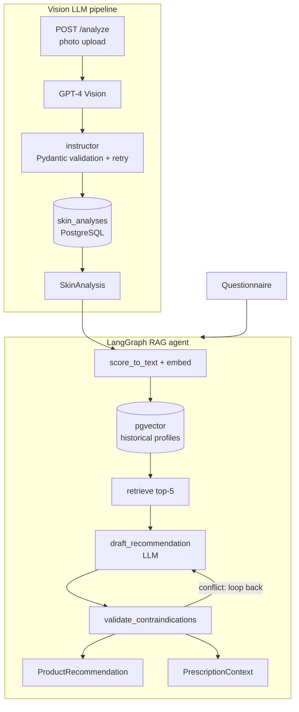
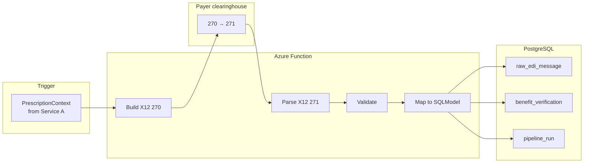
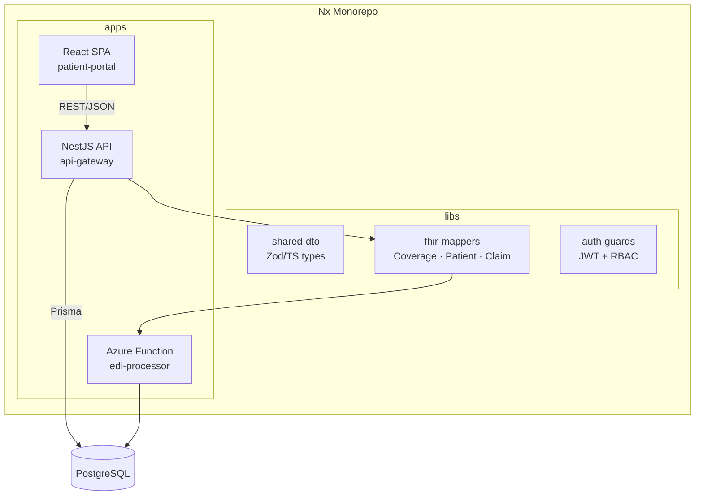

# healthtech-azure — project overview

Telehealth platform services: AI-driven skin analysis and prescribing workflow, pharmacy benefit verification, and a clinician/patient portal. Services share a PostgreSQL backend and Azure infrastructure.

---

# Service A: Skin Analysis & Recommendation Pipeline

An end-to-end AI pipeline that analyzes clinical skin photos, extracts structured scores, and produces product recommendations alongside a clinical context payload forwarded to the pharmacy benefit verification service and the prescribing physician.

## What it does

1. **Vision LLM layer** — Accepts a photo upload, calls GPT-4 Vision via `instructor` for structured output enforcement, and persists a validated `SkinAnalysis` object (lesion count, hyperpigmentation index, severity, Fitzpatrick scale, landmark deltas) to PostgreSQL.
2. **RAG recommendation agent** — Takes the stored `SkinAnalysis` and a patient questionnaire, embeds a clinical description of the scores, retrieves the top-5 most similar historical treatment profiles from pgvector, drafts a product recommendation, validates it against the patient's contraindications in a bounded retry loop (max 2 iterations), and produces two outputs in a single agent run:
   - `ProductRecommendation` — returned to the caller for display to the patient
   - `PrescriptionContext` — structured clinical summary (scores, recommended products, contraindications checked) handed off to Service B for pharmacy benefit verification before reaching the prescribing physician
3. **FastAPI service** — `POST /analyze` (photo upload → scores) and `POST /recommend` (analysis ID + questionnaire → both outputs).
4. **Observability** — LangSmith traces every LLM call with per-node latency, token cost, and the validation loop step.

## Architecture



## File layout (`skin-analysis/`)

```
vision/          analyzer.py · models.py
embedder.py · retriever.py
ingest/          seed.py (Pandas → synthetic profiles → pgvector)
chains/          recommend_chain.py (LCEL baseline)
agents/          recommendation_agent.py (LangGraph)
api/             main.py · vision.py · models.py · deps.py
config.py
samples/         synthetic_profiles.csv · test_photos/
tests/
docker-compose.yml
```

## Implementation phases

| Phase | Scope |
|---|---|
| 0 | Vision LLM pipeline — GPT-4V + `instructor` + `/analyze` endpoint |
| A | pgvector + embedder + synthetic seed (Pandas) |
| B | LangChain LCEL chain + LangSmith |
| C | LangGraph agent + contraindication loop + dual output |
| D | FastAPI `/recommend` endpoint |
| E | Azure OpenAI + Docker + CI |
| F | Documentation + runbook |

---

# Service B: Pharmacy Benefit Verification Pipeline

Receives a `PrescriptionContext` from Service A, submits an X12 270 pharmacy benefit inquiry to the payer clearinghouse, parses the 271 response for formulary coverage and prior authorisation status, and persists the verified benefit snapshot. Service C reads this snapshot to populate the provider case view before the case reaches the prescribing physician.

## What it does

1. **Trigger** — HTTP POST from Service A carrying `PrescriptionContext` (patient ID, analysis ID, recommended product SKUs).
2. **Build X12 270** — construct a pharmacy benefit eligibility inquiry for the patient's plan and the specific product SKUs in the recommendation.
3. **Submit + receive** — send 270 to the payer clearinghouse; receive 271 response via Azure Blob drop or synchronous HTTP depending on payer.
4. **Parse + validate** — `x12-python` parses the 271 envelope; structured errors returned on failure.
5. **Map** — 271 segments mapped to Pydantic DTOs and SQLModel tables: formulary tier, coverage flag, prior auth required, out-of-pocket estimate.
6. **Persist** — single DB transaction writes `raw_edi_message`, `benefit_verification`, `pipeline_run`; idempotent via payload hash.
7. **Notify** — writes `benefit_status` to the case row; Service C picks it up for the provider view.

## Integration with Service A

```
Service A POST /recommend
  → PrescriptionContext { patient_id, analysis_id, recommended_products }
      → Service B POST /verify-benefit
          → X12 270 to payer clearinghouse
          ← X12 271 response
          → benefit_verification row written
          → case.benefit_status updated (consumed by Service C)
```

## Architecture



## Data model

- `RawEdiMessage` — id, source, payload_hash, received_at, raw_text
- `BenefitVerification` — FK → raw, patient_id, analysis_id, product_sku, formulary_tier, covered, prior_auth_required, oop_estimate, verified_at
- `PipelineRun` — status, error, duration

Idempotency: unique constraint on `(payload_hash)`; duplicate 271 responses are skipped without error.

## Implementation phases

### Phase A — Local core

1. Python 3.11+, `ruff`, `mypy`, `pytest`.
2. `x12-python` dependency (pinned).
3. Test fixtures: `samples/270_pharmacy_request.edi`, `samples/271_pharmacy_response.edi` (fabricated member IDs, fake plan data).
4. `build_270(context: PrescriptionContext) -> str` — constructs X12 270 pharmacy benefit inquiry.
5. `parse_271(content: str) -> ParsedEnvelope` — catches parser errors, returns Pydantic result.
6. Golden-file unit tests on built 270 segment structure and parsed 271 field extraction.

### Phase B — PostgreSQL + SQLModel

1. `docker compose` with PostgreSQL 16.
2. SQLModel models (see data model above).
3. `process_verification(session, context: PrescriptionContext) -> VerificationResult` — single DB transaction; rollback on parse failure; dead-letter row on payer error.

### Phase C — Pydantic at the edges

1. `VerificationRequest`, `VerificationResponse`, `BenefitDetail`, `ErrorDetail` models.
2. `pydantic-settings` config: `DATABASE_URL`, `CLEARINGHOUSE_URL`, `LOG_LEVEL`.

### Phase D — Azure Functions

1. HTTP-triggered function `POST /verify-benefit` called by Service A.
2. Blob trigger on `inbound/271/*.edi` for async payer drops.
3. Local run via Azure Functions Core Tools.
4. Optional: Azure Service Bus queue between Service A and this function for retry resilience.

### Phase E — CI + documentation

1. GitHub Actions: lint, typecheck, tests on push.
2. Runbook: how to run locally, env vars, how to replay a failed verification, how to add a new payer.

---

# Service C: Patient Portal & Case Management

Clinician-facing case management and patient-facing portal. Consumes skin analysis scores from Service A and pharmacy benefit data from Service B to present the provider with a complete pre-built clinical picture before they approve or decline a prescription. Exposes FHIR R4 resource endpoints for downstream health system integrations.

## What Service C consumes from upstream services

| Source | Data | Consumed as |
|---|---|---|
| Service A | `SkinAnalysis`, `PrescriptionContext` | case clinical summary, recommendation reasoning |
| Service B | `BenefitVerification` | formulary coverage, prior auth status on case view |
| Service B | `pipeline_run` status | case audit trail |

## Architecture



## Domain entities (Prisma)

```
Patient        — demographics, MRN, linked coverage
Coverage       — FHIR R4 Coverage shape, FK → eligibility_transaction
Case           — case_number, status enum, assigned_to, opened_at, closed_at
CaseNote       — body, author_id, FK → case
CaseDocument   — blob_url, uploaded_by, FK → case
AuditLog       — actor, action, resource_type, resource_id, ts
```

FHIR alignment: `Coverage`, `Patient`, `EpisodeOfCare` map to R4 resources without additional joins.

## Implementation phases

### Phase F — Nx monorepo scaffold

1. `npx create-nx-workspace@latest healthtech --preset=ts`.
2. Apps: `patient-portal` (React + Vite), `api-gateway` (NestJS).
3. Libs: `shared-dto` (Zod schemas), `fhir-mappers`, `auth-guards`.
4. `tsconfig` paths for `@healthtech/*` resolution.
5. `nx affected` configured for CI.

### Phase G — NestJS API

1. Prisma setup: `schema.prisma` with all domain entities, migrations.
2. Modules: `PatientModule`, `CoverageModule`, `CaseModule`, `AuditModule`.
3. Auth: `@nestjs/jwt` guard + `@Roles('clinician', 'admin')` RBAC decorator.
4. OpenAPI: `@nestjs/swagger` on all DTOs and controllers; spec committed to repo.

### Phase H — FHIR layer

1. `fhir-mappers` lib: pure functions, fully unit-tested.
   - `toFhirPatient(prismaPatient) -> fhir4.Patient`
   - `toFhirCoverage(prismaEligibility) -> fhir4.Coverage`
   - `toFhirEpisodeOfCare(prismaCase) -> fhir4.EpisodeOfCare`
2. `@types/fhir` for R4 type safety.
3. Endpoints: `GET /fhir/Patient/:id`, `GET /fhir/Coverage?patient=:id`.

### Phase I — React patient portal

| Route | Purpose |
|---|---|
| `/login` | JWT login |
| `/dashboard` | Patient list + quick stats |
| `/patients/:id` | Demographics + active coverage card |
| `/patients/:id/cases` | Case list |
| `/cases/:id` | Case detail — notes, documents, status |
| `/cases/new` | Open new case |

Stack: React Router v6 · TanStack Query · Zustand · React Hook Form + Zod · shadcn/ui.

### Phase J — Azure deployment

1. **Azure Static Web Apps** — React SPA, CI/CD from GitHub Actions.
2. **Azure Container Apps** — NestJS API.
3. **Azure Database for PostgreSQL Flexible Server** — shared across all services.
4. **Azure Blob Storage** — case documents.
5. **Managed Identity** — all service-to-service auth; no secrets in environment files.
6. Optional: **Azure API Management** as a unified gateway.

### Phase K — Documentation + CI

1. Architecture diagram, local run instructions, migration guide.
2. GitHub Actions: `nx affected:test`, `nx affected:lint`, `nx affected:build` on PR; deploy SPA on merge to main.

---

## References

| Resource | Purpose |
|----------|---------|
| [x12-python](https://github.com/copyleftdev/x12-python) | X12 270/271 parse/validate; uses Pydantic internally |
| [x12-edi-tools](https://github.com/copyleftdev/x12-edi-tools) | Supporting X12 toolkit, same maintainer ecosystem |
| [Stedi: 270/271 for developers](https://www.stedi.com/docs/healthcare/understanding-the-eligibility-check-270-271-process) | Conceptual flow reference for pharmacy benefit inquiry design |
| [CMS X12 HIPAA guides](https://www.cms.gov/priorities/key-initiatives/bur-reduction/interoperability/x12) | Official 5010 transaction set context |

**PHI:** All test fixtures use fabricated member IDs, fake plan data, and no real patient names. Raw photos are never stored — only the extracted `SkinAnalysis` score object.
