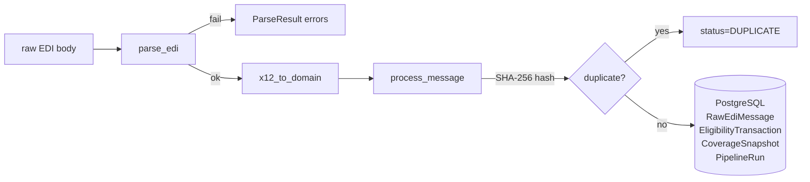

# eligibility-pipeline

[](https://pypi.org/project/eligibility-pipeline/)
[](https://pypi.org/project/eligibility-pipeline/)
[](https://github.com/mssdef/edi-pipeline-gh/actions/workflows/ci.yml)

Python 3.11+ library — X12 270/271 eligibility pipeline: parse, validate, and persist healthcare eligibility transactions.

Healthcare providers send X12 270 eligibility inquiry messages to payers, who respond with X12 271 eligibility responses. This library ingests those messages, validates and parses them, and persists them to PostgreSQL in a single idempotent transaction.

> **Portfolio MVP** — synthetic 270/271 fixtures, no real PHI, no production clearinghouse integration.

---

## Architecture



---

## Installation

```bash
pip install eligibility-pipeline
```

With Azure Functions support:

```bash
pip install eligibility-pipeline[azure]
```

---

## Local setup

**Prerequisites:** Python 3.11+, Docker

```bash
# 1. Install (from repo root)
python -m venv .venv && source .venv/bin/activate
pip install -e "libs/eligibility-pipeline[dev,azure]"

# 2. Start PostgreSQL
make up

# 3. Apply migrations
alembic upgrade head
```

---

## Usage

### Parse an EDI message

```python
from eligibility_pipeline.parse import parse_edi

result = parse_edi(raw_edi_string)
if result.success:
    print(result.data)
else:
    for err in result.errors:
        print(err.code, err.message)
```

### Process end-to-end

```python
from eligibility_pipeline.services.process_message import process_message
from eligibility_pipeline.models import ProcessRequest
from eligibility_pipeline.db.session import get_session

request = ProcessRequest(body=raw_edi_string, source="my-system")
session = next(get_session())
result = process_message(session, request)
print(result.status)   # SUCCESS | DUPLICATE | PARSE_FAILURE | DB_ERROR
```

### CLI

```bash
eligibility-pipeline --help
```

---

## Database schema

| Table | Purpose |
|---|---|
| `raw_edi_message` | Raw payload + SHA-256 hash (unique constraint for idempotency) |
| `eligibility_transaction` | Parsed control numbers, direction, trading partner |
| `coverage_snapshot` | Normalised member/plan/active fields |
| `pipeline_run` | Processing status per raw message |

Run migrations:

```bash
alembic upgrade head
```

---

## Testing

```bash
# Unit tests (no database)
pytest

# Integration tests (requires Docker)
make up
pytest -m integration
```

---

## Replaying a failed message

A `PARSE_FAILURE` run commits the raw payload to `raw_edi_message`. The SHA-256 deduplication hash is only written on `SUCCESS`, so re-submitting a previously failed payload will reprocess it normally.

```sql
SELECT r.id, r.error_message, m.received_at
FROM pipeline_run r
JOIN raw_edi_message m ON m.id = r.raw_edi_message_id
WHERE r.status = 'PARSE_FAILURE'
ORDER BY m.received_at DESC;
```

Re-submit via `apps/edi-processor` HTTP trigger or call `process_message` directly.

---

## Configuration

All settings are read from environment variables via `pydantic-settings`:

| Variable | Required | Default | Description |
|---|---|---|---|
| `DATABASE_URL` | Yes | — | PostgreSQL connection string |
| `LOG_LEVEL` | No | `INFO` | Python logging level |

Set via `.env` at the repo root or export before running.

---

## Project layout

```
src/eligibility_pipeline/
  __init__.py              ← __version__
  parse.py                 ← parse_edi() + ParseResult / ParseError
  models.py                ← ProcessRequest / ProcessResponse / ErrorDetail
  settings.py              ← pydantic-settings Settings
  cli.py                   ← CLI entry point
  db/
    models.py              ← SQLModel tables + RunStatus enum
    session.py             ← engine + get_session()
    migrations/            ← Alembic env + versions
  services/
    process_message.py     ← single-transaction ingest service
  mappers/
    x12_to_domain.py       ← parsed X12 → EligibilityTransaction + CoverageSnapshot
samples/
  270_request.edi          ← synthetic 270 inquiry fixture
  271_response.edi         ← synthetic 271 response fixture
tests/
  conftest.py
  test_parse.py
  test_process_message.py
  test_azure_functions_http.py
```
